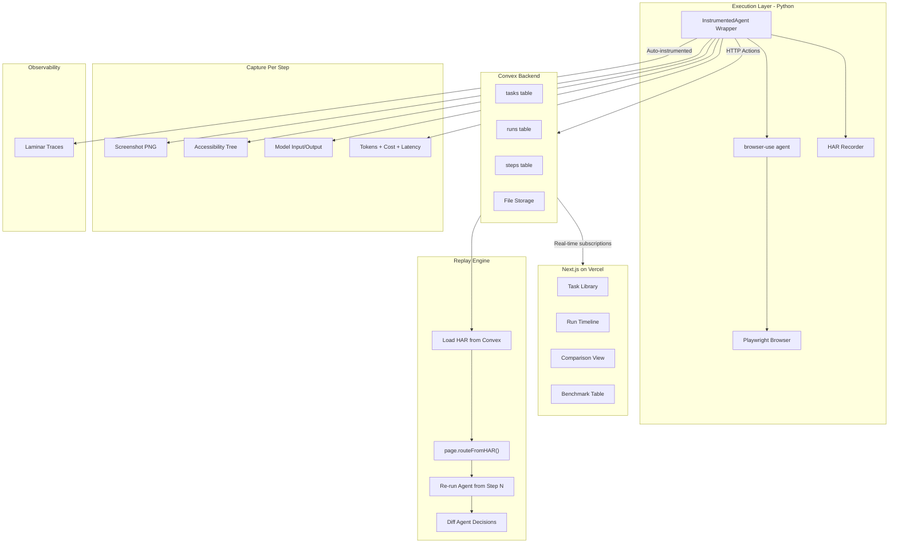

# ReplayBench: Foolproof Hackathon Battle Plan

## What a YC Judge Wants to See

**Impact Potential (40%)** -- The single biggest lever. Judges will ask: "Would someone pay for this?" The answer must be visceral. Every company building web agents (Browser Use, Anthropic, OpenAI, dozens of YC startups) hits the same wall: agents fail unpredictably, failures can't be reproduced, and there's no way to regression test. ReplayBench is the missing DevOps layer. Frame it as: "We're building pytest + Jenkins for web agents."

**Creativity (20%)** -- HAR-based deterministic replay for agent debugging is genuinely novel. The "Determinism Score" metric is a new concept. Framing agent testing as CI/CD is the right abstraction.

**Technical Difficulty (20%)** -- Playwright HAR interception, execution graph capture, real-time Convex subscriptions, multi-model benchmarking. This is deep infra work, not a wrapper.

**Demo & Presentation (20%)** -- The live demo must tell a story: agent fails, replay from failure point, different agent succeeds, benchmark table updates. This is the mic-drop moment.

---

## Critical Strategic Decisions

### Use Browser Use Open-Source (NOT Cloud API)

The Cloud API runs agents in their infrastructure -- you lose Playwright access. Use the open-source `browser-use` Python library directly. This gives you:

- Direct Playwright `BrowserContext` access for HAR recording
- `page.screenshot()` at each step
- `page.accessibility.snapshot()` for the accessibility tree
- `context.route_from_har()` for deterministic replay

### Use Controlled/Static Sites for Demo Tasks

Do NOT demo against live sites that change. Use:

- HUD benchmark environments (WebArena tasks are hosted and controlled)
- A self-hosted simple site (e.g., a mock billing portal on Vercel) as a backup
- Wikipedia (stable, no auth, no CAPTCHA)

### Ruthless MVP Scope

**In scope (must ship):**

- Agent execution capture (screenshot + accessibility tree + model I/O + tokens/cost per step)
- HAR recording per session
- Convex storage with real-time subscriptions
- Dashboard: task list, run timeline (step-by-step with screenshots), comparison view, benchmark table
- HAR-based replay from arbitrary step
- Run 2+ models on same task, compare metrics
- Laminar trace integration (auto-instrumented, nearly free)

**Out of scope (cut it):**

- Full DOM snapshot restore (HAR replay is sufficient and actually works)
- Dynamic element filtering (over-engineered for hackathon)
- Superset integration (confusing, not core -- drop it)
- Agentmail alerts (nice-to-have only if you finish early)
- VibeFlow integration (not core)

### Prize Tracks to Target

- **Top 3 Overall** -- auto-entered, primary target
- **Most Hardcore Infra** -- MANUALLY APPLY. This is your strongest track. HAR replay, execution graphs, deterministic scoring -- this screams hardcore infra.
- **Best Devtool** -- MANUALLY APPLY. This is literally a devtool for agent builders.
- **Founders Prize** -- auto-entered

---

## Technical Architecture



### Convex Schema (Key Tables)

```typescript
// convex/schema.ts
export default defineSchema({
  tasks: defineTable({
    taskId: v.string(),
    url: v.string(),
    goal: v.string(),
    successConditions: v.array(v.string()),
  }),
  runs: defineTable({
    taskId: v.id("tasks"),
    model: v.string(),
    promptVersion: v.optional(v.string()),
    status: v.string(), // "running" | "success" | "failure"
    totalSteps: v.number(),
    totalTokens: v.number(),
    totalCost: v.number(),
    totalLatencyMs: v.number(),
    harFileId: v.optional(v.id("_storage")),
    startedAt: v.number(),
    completedAt: v.optional(v.number()),
  }).index("by_task", ["taskId"]),
  steps: defineTable({
    runId: v.id("runs"),
    stepNumber: v.number(),
    screenshotId: v.optional(v.id("_storage")),
    accessibilityTree: v.string(),
    modelInput: v.string(),
    modelOutput: v.string(),
    action: v.string(),
    tokens: v.number(),
    latencyMs: v.number(),
    cost: v.number(),
  }).index("by_run", ["runId", "stepNumber"]),
});
```

### Core Python: InstrumentedAgent Wrapper

The key technical piece is wrapping browser-use's Agent to capture state at each step:

```python
from browser_use import Agent, Browser, BrowserConfig
from playwright.async_api import BrowserContext
import httpx

class InstrumentedAgent:
    def __init__(self, task, model, convex_url, run_id):
        self.task = task
        self.model = model
        self.convex_url = convex_url
        self.run_id = run_id
        self.step_num = 0

    async def run(self):
        browser = Browser(config=BrowserConfig(
            headless=True,
            # HAR recording is set up on the context
        ))
        # Get Playwright context, enable HAR recording
        context = await browser.new_context(
            record_har_path=f"runs/{self.run_id}.har"
        )
        agent = Agent(
            task=self.task,
            llm=self.model,
            browser=browser,
            on_step_end=self.capture_step,  # Hook into each step
        )
        result = await agent.run()
        # Save HAR file to Convex after run completes
        await self.upload_har(f"runs/{self.run_id}.har")
        return result

    async def capture_step(self, step_info):
        self.step_num += 1
        page = step_info.browser.page
        screenshot = await page.screenshot()
        a11y_tree = await page.accessibility.snapshot()
        # POST to Convex HTTP action
        await httpx.AsyncClient().post(
            f"{self.convex_url}/log_step",
            json={
                "runId": self.run_id,
                "stepNumber": self.step_num,
                "screenshot": base64.b64encode(screenshot).decode(),
                "accessibilityTree": json.dumps(a11y_tree),
                "modelInput": step_info.model_input,
                "modelOutput": step_info.model_output,
                "action": step_info.action,
                "tokens": step_info.token_usage,
                "latencyMs": step_info.latency_ms,
                "cost": step_info.cost,
            }
        )
```

### Replay Engine (The Core Innovation)

```python
async def replay_from_step(original_run_id, start_step, new_model):
    # 1. Load HAR file from Convex storage
    har_path = await download_har(original_run_id)

    # 2. Create new browser context with HAR replay
    browser = await playwright.chromium.launch()
    context = await browser.new_context()
    await context.route_from_har(har_path, not_found="fallback")
    #    ^ This serves cached network responses for ALL matching URLs
    #    Making the environment deterministic

    # 3. Navigate to the state at start_step
    step_data = await get_step(original_run_id, start_step)
    page = await context.new_page()
    await page.goto(step_data["url"])

    # 4. Run the new agent from this point
    agent = Agent(task=original_task, llm=new_model, browser=browser)
    result = await agent.run()

    # 5. Compare decisions at each step
    return diff_results(original_run_id, result)
```

### Determinism Score Formula

Run the same (agent_config, task) N times with HAR replay. At each step, compare the action taken:

```
determinism_score = (number of steps where all N runs chose the same action) / (total steps)
```

A score of 1.0 means the agent is perfectly deterministic under the same network conditions. A score of 0.5 means it picks randomly half the time. This is a genuinely useful metric for production agent teams.

---

## Hour-by-Hour Execution Plan (2 People)

### Phase 1: Foundation (12:00 PM - 2:00 PM) [2 hrs]

**Person 1 (Backend/Agent Infra):**

- Install `browser-use`, `playwright`, `laminar`, `httpx`
- Get a basic browser-use agent running on a simple task (e.g., "Go to wikipedia.org and find the population of France")
- Verify you can access the Playwright page object from browser-use
- Take a screenshot and accessibility snapshot manually
- Initialize Laminar with 1 line: `Laminar.initialize(project_api_key="...")`
- **Checkpoint:** Agent runs, you can print screenshots and a11y trees

**Person 2 (Frontend/Convex):**

- `npm create convex@latest` with Next.js template
- Define the Convex schema (tasks, runs, steps tables)
- Deploy to Convex cloud (`npx convex dev`)
- Set up Vercel deployment for the Next.js app
- Use v0.dev to generate a dashboard layout (dark theme, sidebar nav, timeline component)
- Seed 3 benchmark tasks into Convex
- **Checkpoint:** Convex deployed, schema live, frontend skeleton on Vercel

**GATE CHECK (2:00 PM):** Agent runs locally. Convex schema deployed. Frontend accessible. If either is blocked, stop and fix before proceeding.

### Phase 2: Execution Capture Pipeline (2:00 PM - 6:00 PM) [4 hrs]

**Person 1 (InstrumentedAgent):**

- Build the `InstrumentedAgent` wrapper class
- Hook into browser-use's step callback to capture per-step data
- Enable HAR recording on the Playwright context
- Send step data to Convex via HTTP actions (screenshots as base64 -> Convex file storage)
- Test the full pipeline: agent runs -> steps appear in Convex
- Run the agent on all 3 benchmark tasks, verify data captures correctly
- **Checkpoint:** Complete agent runs with all metadata in Convex

**Person 2 (Dashboard Core Views):**

- Build Convex HTTP actions to receive agent data (mutations for steps, file upload for screenshots/HAR)
- Build **Task Library** page: list of benchmark tasks with status indicators
- Build **Run Timeline** view: vertical timeline of steps, click to see screenshot + accessibility tree + model output
- Wire up real-time Convex subscriptions so the timeline updates live as agent runs
- **Checkpoint:** Can watch an agent run step-by-step in the dashboard in real-time

**GATE CHECK (6:00 PM / Dinner):** Full pipeline works end-to-end. Agent runs -> data flows to Convex -> dashboard shows live timeline. This is the MVP. Everything after this is building on a working foundation.

### Phase 3: Replay Engine + Comparison (6:30 PM - 9:30 PM) [3 hrs]

**Person 1 (Replay Engine):**

- Build the replay function using `context.route_from_har()`
- Test: record a run, replay with same model, verify actions match
- Test: replay with different model, capture divergence points
- Build API endpoint to trigger replay from a specific step
- Store replay results as a new run in Convex (linked to original)
- **Checkpoint:** Can replay from step N and see results in Convex

**Person 2 (Comparison + Benchmark Views):**

- Build **Comparison View**: side-by-side two runs on the same task
  - Split screen: left = Run A timeline, right = Run B timeline
  - Highlight divergence points (where actions differ) in red
  - Show screenshots side-by-side at each step
- Build **Benchmark Table**: aggregate metrics view
  - Columns: Model, Task, Success, Steps, Cost, Latency, Determinism Score
  - Rows: each (model, task) combination
  - Color-coded: green for success, red for failure
- Add "Replay from here" button on the timeline view
- **Checkpoint:** Comparison view shows side-by-side runs. Benchmark table populated.

**GATE CHECK (9:30 PM):** Replay works. Comparison view works. Benchmark table shows data. This is the "wow" feature set.

### Phase 4: Multi-Model Benchmarking + Metrics (9:30 PM - 1:00 AM) [3.5 hrs]

**Person 1 (Benchmarking):**

- Run benchmark suite: 3 tasks x 2-3 models (pick from GPT-4o, Claude 3.5 Sonnet, Gemini 2.0 Flash)
- Compute aggregate metrics per model per task
- Implement Determinism Score: run same config 3x with HAR replay, measure action consistency
- Integrate HUD evaluation if time permits (use `hud.eval()` for standardized scoring)
- **Checkpoint:** Real benchmark data for 2-3 models across 3 tasks

**Person 2 (Dashboard Polish):**

- Add Determinism Score column to benchmark table
- Add cost-per-success metric
- Add Laminar trace links (deep link from each run to its Laminar trace)
- Polish the UI: loading states, error states, proper typography, animations on the timeline
- Add a "hero" landing section at the top explaining what ReplayBench is
- **Checkpoint:** Dashboard looks production-quality

### Phase 5: Demo Hardening (1:00 AM - 3:00 AM) [2 hrs]

**BOTH PEOPLE (Critical):**

- Identify the EXACT demo flow (see Demo Script below)
- Run the demo flow 5+ times end to end
- Pre-seed Convex with a "golden" dataset: runs that always tell the right story (agent fails on Task X with GPT-4o, succeeds with Claude)
- Ensure the dashboard works offline from this pre-seeded data (fallback if live agent fails during demo)
- Record the backup demo video (REQUIRED for submission)
- Screenshot every critical screen
- Test on a fresh browser / incognito to catch any auth/cookie issues
- Write the exact 3-minute pitch script (see below)

### Phase 6: Rest (3:00 AM - 7:30 AM)

Alternate 2-hour sleep shifts. One person monitors, handles any issues, and continues polish.

### Phase 7: Final Rehearsal (7:30 AM - 10:00 AM) [2.5 hrs]

- Practice the pitch AT LEAST 7 times
- Time it strictly to 3 minutes (set a timer)
- Practice transitions between slides and live demo
- Prepare answers for the 5 most likely judge questions (see below)
- Submit on HackHQ before 10:00 AM deadline
- Double-check backup video is uploaded

---

## The 3-Minute Demo Script

### Opening (30 seconds)

"Web agents are going to production. Browser Use has thousands of developers building agents that book flights, fill forms, extract data. But here's the problem: these agents are stochastic. When they fail, you can't reproduce it. When you push a fix, you can't regression test. There is no CI/CD for web agents. We built ReplayBench."

### Show Dashboard (30 seconds)

"Here's our benchmark suite -- three real tasks web agents need to do. Let's look at this one: [specific task]. We ran GPT-4o on it."

Show the run timeline. Click through 3-4 steps quickly. "The agent navigates correctly for the first three steps. But at step 4--" click to show the failure step with screenshot "--it clicks the wrong element and fails."

### The Replay (45 seconds)

"Now here's what makes ReplayBench different. We recorded the entire network state using HAR. I click 'Replay from Step 3'--" click the button "--and ReplayBench loads the exact same page state. Same network responses, same DOM. Now we run Claude from this exact point."

Show the replay running live (or show the pre-cached result appearing). "Claude takes a different action at step 4 and succeeds."

### Benchmark Results (30 seconds)

"The benchmark table updates in real-time." Switch to benchmark view. "Across three tasks: Claude succeeds on all three, GPT-4o fails on one. Claude costs $0.08 per task, GPT-4o costs $0.12. And look at this column -- Determinism Score. We run each agent 3 times on the same frozen environment. Claude scores 0.91 -- highly deterministic. GPT-4o scores 0.64 -- flipping a coin half the time."

### Closing (30 seconds)

"Every trace is captured in Laminar for deep debugging." Flash Laminar dashboard. "Every company building web agents will need deterministic debugging, regression testing, and version comparison. ReplayBench is the DevOps layer for autonomous web systems."

### Q&A Prep (1 minute buffer)

**"Who would use this?"** -- Any team building web agents for production. Browser Use users, Anthropic Computer Use integrators, startups building RPA with LLMs.

**"How is this different from Playwright tracing?"** -- Playwright traces test static scripts. We trace autonomous agents -- the model decides the next action, and we capture + replay the entire decision chain, not just the browser state.

**"Can you really make the web deterministic?"** -- Not fully, but HAR replay makes network responses deterministic, which eliminates the biggest source of variance. Our Determinism Score quantifies exactly how much non-determinism remains.

**"What's the business model?"** -- Usage-based pricing per agent run captured. Free tier for open-source, paid for teams. Same model as Datadog/Sentry.

**"What about login-protected sites?"** -- Browser Use supports persistent profiles with saved cookies. We capture and replay the full session state including auth.

---

## 3 Benchmark Tasks (Define Before Hacking Starts)

Pick tasks that are: (a) visually impressive in the demo, (b) reliable enough to work, (c) different enough to show versatility.

1. **Search & Extract**: "Go to Wikipedia, find the GDP of Japan, and return the number" -- simple, always works, shows data extraction
2. **Multi-Step Navigation**: "Go to Hacker News, find the top post, click through, and extract the article title" -- shows multi-step reasoning
3. **Form Interaction**: "Go to [a controlled test form site], fill in name/email/message, and submit" -- shows form interaction (use a site you control or httpbin.org)

---

## Sponsor Integration Checklist

| Sponsor | Integration | Effort |
|---|---|---|
| **Browser Use** | Core agent runtime (open-source lib) | Core |
| **Convex** | Real-time backend, file storage, schema | Core |
| **Vercel** | Frontend hosting | 5 min |
| **Laminar** | `Laminar.initialize()` + auto-traced LLM calls | 10 min |
| **HUD** | Evaluation scoring on benchmark tasks | 1 hr |
| **v0.dev** | Generate dashboard UI components | Used during frontend dev |
| **OpenAI** | GPT-4o as one benchmark model | Core |
| **Google DeepMind** | Gemini as one benchmark model | Core |
| **Anthropic** | Claude as one benchmark model | Core |

**Drop** Superset, VibeFlow, Cubic, Agentmail from core plan. Mention them in submission if there's time for trivial integration.

---

## Risk Mitigation Table

- **Risk: browser-use agent hook API doesn't expose step callbacks cleanly** -- Mitigation: Read browser-use source code in first 30 min. If hooks don't work, monkey-patch or subclass the Agent. Worst case: run agent, parse logs after the fact.
- **Risk: HAR replay doesn't work for target site** -- Mitigation: Test HAR replay in Phase 1 on a simple site. If it breaks, use a fully controlled local site. The concept still demos well.
- **Risk: Convex file storage is slow for screenshots** -- Mitigation: Store screenshots as base64 data URLs in the step record (small PNGs). Only use file storage for HAR files.
- **Risk: Live demo agent fails during judging** -- Mitigation: Pre-seed Convex with "golden" runs. Demo flow: show pre-existing data, then trigger a live replay. If the live replay fails, the pre-existing data still tells the story.
- **Risk: Running out of LLM API credits** -- Mitigation: Use Gemini Flash (cheapest) for most test runs. Save GPT-4o and Claude for the final benchmark data. Use the $20 Google credit, OpenAI credit, and $2.5k Anthropic credit wisely.
- **Risk: Dashboard looks ugly** -- Mitigation: Use v0.dev to generate polished components. Use shadcn/ui as the component library. Dark theme always looks good for devtools.

---

## What Makes This Win "Most Hardcore Infra"

This is your STRONGEST track. Emphasize in the manual application:

- Playwright HAR interception for deterministic network replay
- Execution graph data model with per-step state capture
- Real-time Convex subscriptions for live dashboard updates
- Determinism Score -- a novel quantitative metric
- Multi-model A/B benchmarking infrastructure
- Zero-config Laminar tracing integration

---

## Files to Create at Hackathon Start

```
replaybench/
  backend/
    agent_wrapper.py         # InstrumentedAgent class
    replay_engine.py         # HAR-based replay logic
    benchmark_runner.py      # Run tasks across models
    tasks.yaml               # Benchmark task definitions
    requirements.txt         # browser-use, playwright, laminar, httpx
  convex/
    schema.ts                # Convex schema
    tasks.ts                 # Task queries/mutations
    runs.ts                  # Run queries/mutations
    steps.ts                 # Step queries/mutations
    http.ts                  # HTTP actions for Python -> Convex
  frontend/
    src/
      app/
        page.tsx             # Dashboard home / task library
        runs/[id]/page.tsx   # Run timeline view
        compare/page.tsx     # Side-by-side comparison
        benchmark/page.tsx   # Benchmark table
      components/
        Timeline.tsx         # Step timeline component
        StepCard.tsx         # Individual step display
        ComparisonView.tsx   # Side-by-side diff
        BenchmarkTable.tsx   # Metrics table
    package.json
  README.md
```
