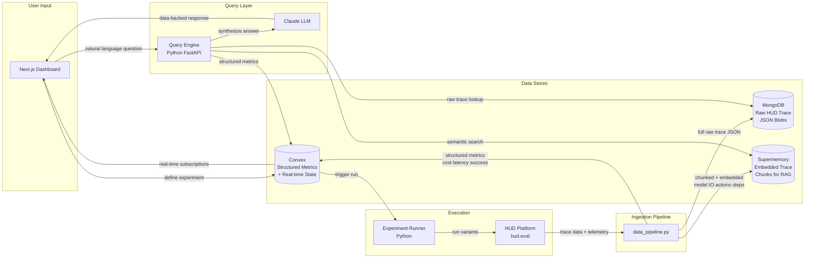
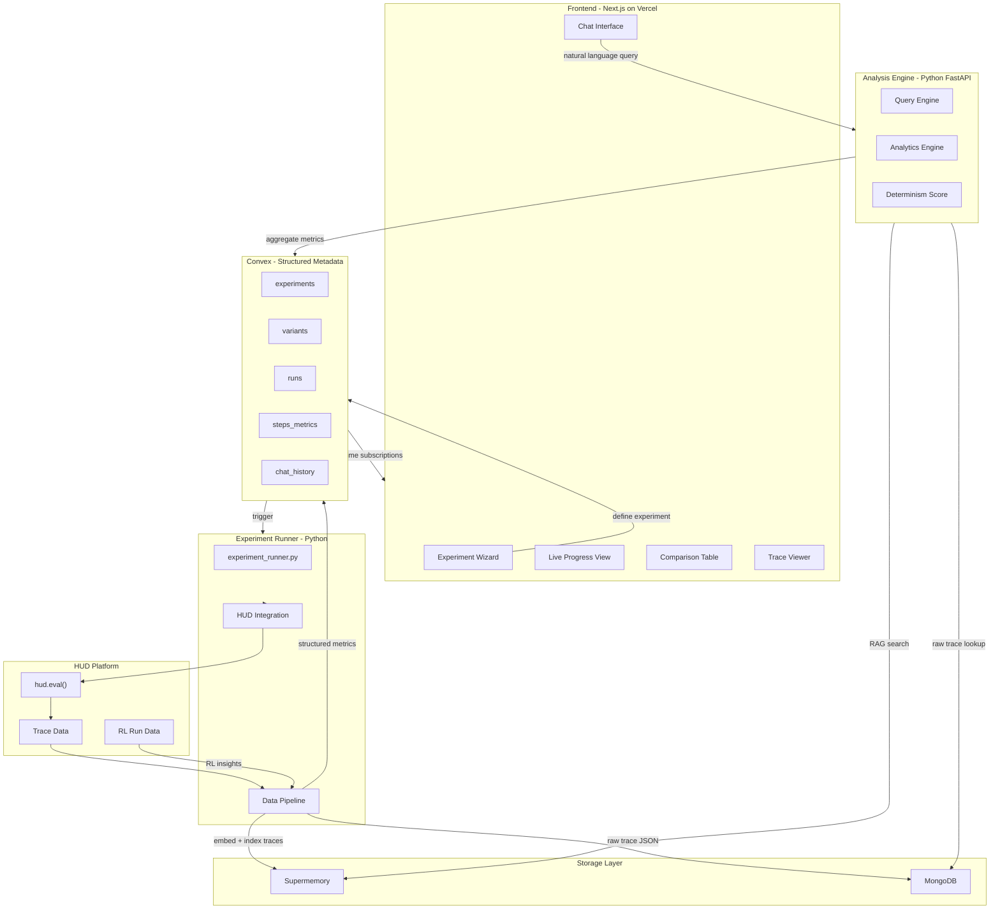

# AgentLens: Foolproof Hackathon Battle Plan

> **North Star:** A managed platform for AI-driven experiment design, execution, and data analysis over web agent traces.
>
> **Name note:** "ReplayBench" is retired. Working name is **AgentLens** -- but pick a final name by 12PM tomorrow.

---

## What a YC Judge Wants to See

**Impact Potential (40%)** -- Every team building a production web agent faces the same question: *which model, which tools, which architecture should I actually use?* Today they guess. AgentLens lets them run structured experiments across models and configs, then ask an AI "given my latency constraint, which setup wins?" -- and get a data-backed answer. This is Weights & Biases for web agents. Every serious agent company will pay for this.

**Creativity (20%)** -- Indexing multi-modal agent traces (screenshots, LLM I/O, telemetry) into a semantic memory layer and enabling conversational analysis over them is genuinely novel. Nobody has built this for web agents.

**Technical Difficulty (20%)** -- Multi-modal trace ingestion pipeline, Supermemory semantic indexing, RAG-powered conversational query engine, HUD eval orchestration, real-time Convex subscriptions, RL data analysis. This is a full-stack ML infra project in 20 hours.

**Demo & Presentation (20%)** -- The demo must show the "aha" moment: define an experiment, watch it run, then ask a natural language question and get a specific, data-backed answer from the AI. That's the mic-drop.

---

## What Changed from the Original Idea

| Old (ReplayBench) | New (AgentLens) |
|---|---|
| We built our own agent runner + HAR replay | HUD runs the agents -- we build on top of it |
| Deterministic replay was the core innovation | Semantic search + conversational AI over traces is the core innovation |
| Infra-layer for reproducibility | Intelligence layer for decision-making |
| "pytest for agents" | "Weights & Biases for agents" |
| Supermemory was dropped | Supermemory is now core (semantic trace indexing) |
| HUD was a nice-to-have | HUD is the execution engine |

**Why this is better:** The HUD sponsor confirmed they have most infra features built. Building *on top* of HUD is higher leverage than rebuilding what HUD already does. The insight layer (semantic search + conversational AI) is where the real value is and what HUD doesn't have.

---

## Critical Strategic Decisions

### HUD is the Execution Engine -- Don't Reinvent It

HUD provides:
- Agent execution via `hud.eval()` with full telemetry
- Trace IDs for every run
- Support for Browser Use, Claude Computer Use, and custom agents
- RL training loops and RL run data
- Parallel execution with configurable concurrency

We consume HUD's output. We do NOT build our own agent runner.

### Supermemory is the Intelligence Layer

Supermemory gives us:
- Sub-400ms hybrid semantic search over stored content
- Multi-modal support (text, images, markdown, HTML)
- Container-based filtering (isolate by experiment, model, task)
- No vector DB infrastructure to manage

Every trace (model I/O, screenshots, telemetry) gets indexed into Supermemory. The conversational query engine does RAG over this. This is what makes AgentLens intelligent, not just a dashboard.

### Convex is the Structured Metadata Store

Supermemory handles semantic retrieval. Convex handles:
- Experiment definitions and status (real-time subscriptions for live progress)
- Structured metrics (cost, latency, success rate, steps)
- Conversation history
- The aggregations that power the comparison table and analytics charts

### MongoDB is the Raw Trace Archive

Full trace JSON blobs from HUD are too large and too unstructured for Convex. MongoDB stores:
- Full HUD trace payloads per run
- Screenshot metadata and URLs
- Step-level raw data before it's chunked into Supermemory

---

## Database Roles -- The Simple Mental Model

| Database | Type | What we store | Why this one |
|---|---|---|---|
| **Convex** | Structured relational + real-time | Experiment configs, variant definitions, per-run metrics (cost/latency/success/steps/determinism), chat history | Real-time subscriptions power the live dashboard. Fast structured queries for the comparison table and analytics charts. |
| **MongoDB** | Document store | Full raw HUD trace JSON blobs per run -- large, deeply nested, unstructured payloads | HUD trace payloads don't fit a relational schema. MongoDB handles arbitrary-depth JSON cheaply. Free Atlas cluster from hackathon. |
| **Supermemory** | Vector / semantic memory | Chunked + embedded trace content: model I/O text, step summaries, actions taken | Powers the conversational query engine via RAG. When you ask "which model is fastest?", Supermemory finds the relevant trace chunks. Neither Convex nor MongoDB can do semantic search. |

- **"Did this run succeed and how much did it cost?"** → Convex
- **"Show me the full raw trace JSON for run X"** → MongoDB
- **"Which model handled navigation tasks better?"** → Supermemory → Claude

---

## Single Architecture Diagram



---

## Technical Architecture (Full Detail)



---

## Convex Schema

```typescript
// convex/schema.ts
export default defineSchema({
  experiments: defineTable({
    name: v.string(),
    taskGoal: v.string(),
    taskUrl: v.string(),
    successConditions: v.array(v.string()),
    status: v.string(), // "pending" | "running" | "completed"
    createdAt: v.number(),
  }),

  variants: defineTable({
    experimentId: v.id("experiments"),
    model: v.string(),           // "gpt-4o" | "claude-3-5-sonnet-..." | "gemini-2.0-flash"
    toolConfig: v.string(),      // JSON string of enabled tools
    architecture: v.string(),    // "single_agent" | "multi_agent"
    hudRunId: v.optional(v.string()),
    status: v.string(),          // "pending" | "running" | "success" | "failure"
  }).index("by_experiment", ["experimentId"]),

  runs: defineTable({
    variantId: v.id("variants"),
    experimentId: v.id("experiments"),
    hudTraceId: v.optional(v.string()),
    totalSteps: v.number(),
    totalTokens: v.number(),
    totalCostUsd: v.number(),
    totalLatencyMs: v.number(),
    success: v.boolean(),
    determinismScore: v.optional(v.number()),
    supermemoryContainerId: v.optional(v.string()),
    startedAt: v.number(),
    completedAt: v.optional(v.number()),
  }).index("by_experiment", ["experimentId"]),

  chatMessages: defineTable({
    experimentId: v.id("experiments"),
    role: v.string(), // "user" | "assistant"
    content: v.string(),
    sourcedRunIds: v.optional(v.array(v.string())),
    createdAt: v.number(),
  }).index("by_experiment", ["experimentId"]),
});
```

---

## Data Pipeline: HUD Trace → Supermemory

This is the core technical piece. After each HUD run completes:

```python
async def ingest_run(hud_trace_id: str, run_metadata: dict):
    # 1. Fetch full trace from HUD
    trace = await hud_client.get_trace(hud_trace_id)

    # 2. Store raw trace in MongoDB
    mongo_db.traces.insert_one({"trace_id": hud_trace_id, **trace})

    # 3. Build Supermemory container ID for this experiment
    container_id = f"experiment-{run_metadata['experiment_id']}"

    # 4. Index each step as a Supermemory memory
    for step in trace["steps"]:
        content = f"""
        Model: {run_metadata['model']}
        Task: {run_metadata['task_goal']}
        Step {step['number']}: {step['action']}
        Model Input: {step['model_input']}
        Model Output: {step['model_output']}
        Tokens: {step['tokens']} | Cost: ${step['cost_usd']:.4f} | Latency: {step['latency_ms']}ms
        """
        await supermemory.add(
            content=content,
            metadata={
                "experiment_id": run_metadata["experiment_id"],
                "model": run_metadata["model"],
                "architecture": run_metadata["architecture"],
                "success": run_metadata["success"],
                "step_number": step["number"],
                "cost_usd": step["cost_usd"],
                "latency_ms": step["latency_ms"],
            },
            container_id=container_id,
        )
```

---

## Conversational Query Engine

The intelligence layer. User asks a natural language question; we do RAG over Supermemory + structured metrics from Convex:

```python
async def answer_query(question: str, experiment_id: str) -> str:
    container_id = f"experiment-{experiment_id}"

    # 1. Semantic search over all trace steps for this experiment
    relevant_traces = await supermemory.search(
        query=question,
        container_id=container_id,
        limit=20,
    )

    # 2. Fetch structured metrics from Convex for ground truth
    metrics = await convex.query("runs:getExperimentMetrics", {"experimentId": experiment_id})

    # 3. Build RAG context
    context = format_context(relevant_traces, metrics)

    # 4. Answer with LLM (use Claude for best reasoning)
    response = await anthropic_client.messages.create(
        model="claude-3-5-sonnet-20241022",
        system="""You are an AI agent performance analyst. You answer questions about
        web agent experiment results using trace data and metrics. Be specific --
        cite actual numbers from the data. Make concrete recommendations.""",
        messages=[
            {"role": "user", "content": f"Context:\n{context}\n\nQuestion: {question}"}
        ]
    )
    return response.content[0].text
```

**Example queries the system handles well:**
- "Which model has the best cost-performance ratio?"
- "Given my task must complete in under 10 seconds, which model and tool config should I use?"
- "Why did GPT-4o fail on the form submission task?"
- "Show me the steps where Claude made a different decision than GPT-4o"
- "Which architecture -- single agent or multi-agent -- is more reliable for navigation tasks?"
- "How does Gemini's performance change across my 3 tasks?"

---

## Determinism Score (Preserved from Original)

Still a core metric. Run the same variant 3 times. At each step, compare the action taken:

```
determinism_score = (steps where all 3 runs chose same action) / (total steps)
```

This is indexed into Supermemory so you can ask: "which model is most deterministic?"

---

## RL Insights (Bonus Feature)

HUD provides RL training loops. If RL run data is available:
- Index RL trajectory data into Supermemory tagged with `run_type: "rl"`
- Enable queries like: "after 50 RL training steps, which model showed the most improvement?"
- Show a learning curve chart: success rate vs RL iteration

---

## Hour-by-Hour Execution Plan (2 People)

### Phase 1: Foundation (12:00 PM - 2:00 PM) [2 hrs]

**Person 1 (Backend):**
- Read HUD SDK docs: confirm `hud.eval()` API, how to get trace data back, what fields are available
- Write `backend/hud_runner.py`: trigger a single HUD eval for a Browser Use agent, print raw trace output
- Set up MongoDB connection (Atlas free cluster from hackathon email)
- **Checkpoint:** HUD eval runs, raw trace data printed to console

**Person 2 (Frontend + Convex):**
- Replace `convex/schema.ts` with the new schema (experiments, variants, runs, chatMessages)
- Deploy updated schema with `npx convex dev`
- Build the **Experiment Creation Wizard** (multi-step form: task goal + URL, model checkboxes, architecture select)
- Wire form submission to Convex mutation
- **Checkpoint:** Can create an experiment and see it in Convex dashboard

**GATE CHECK (2:00 PM):** HUD eval runs from Python. Experiment can be created from UI and stored in Convex.

---

### Phase 2: Execution + Ingestion Pipeline (2:00 PM - 6:00 PM) [4 hrs]

**Person 1 (Data Pipeline):**
- Build `backend/data_pipeline.py`: pull HUD trace → store raw in MongoDB → chunk + embed → index into Supermemory
- Set up Supermemory client with container-per-experiment isolation
- Build `backend/experiment_runner.py`: loop over variants, fire HUD evals in parallel, call ingestion pipeline on completion
- Update run status in Convex via HTTP actions as each variant completes
- **Checkpoint:** Full pipeline: experiment defined → HUD runs → traces in Supermemory + MongoDB → Convex metrics updated

**Person 2 (Dashboard Core):**
- Build **Live Progress View**: real-time list of variants with status badges (pending / running / success / failure), updating via Convex subscriptions
- Build **Comparison Table**: when all variants complete, show table of Model | Success | Steps | Cost | Latency | Determinism Score
- Color-code rows (green = success, red = failure)
- Add HTTP actions in `convex/http.ts` for Python to update run status
- **Checkpoint:** Can watch experiment progress live and see results table populate

**GATE CHECK (6:00 PM / Dinner):** End-to-end works. Experiment runs → HUD executes → data indexed → dashboard shows live progress and results table. THIS IS THE MVP.

---

### Phase 3: Conversational Query Engine (6:30 PM - 9:30 PM) [3 hrs]

**Person 1 (Query Engine + API):**
- Build `backend/query_engine.py`: Supermemory semantic search + Convex metrics retrieval + Claude LLM synthesis
- Wrap it in a FastAPI endpoint: `POST /query` with `{experiment_id, question}`
- Test with real queries: "which model is cheapest?", "why did X fail?"
- Deploy FastAPI with uvicorn locally (Vercel functions or Railway for hosting if time allows)
- **Checkpoint:** Can POST a question and get a data-backed answer

**Person 2 (Chat Interface):**
- Build **Chat Interface** component in the dashboard: message input + scrollable conversation history
- Wire to the `/query` FastAPI endpoint
- Show sources: for each AI answer, show which runs/steps were cited
- Build **Trace Viewer**: click any run in the comparison table → see step-by-step trace with model I/O
- **Checkpoint:** Chat works in UI, clicking a run shows trace detail

**GATE CHECK (9:30 PM):** Can ask natural language questions about experiment results and get intelligent answers. This is the "wow" feature.

---

### Phase 4: Polish + RL Insights + Determinism (9:30 PM - 1:00 AM) [3.5 hrs]

**Person 1:**
- Compute and store Determinism Score (run top 2 variants 3x each, compare step actions)
- If HUD RL data is accessible: ingest RL trajectories, build learning curve endpoint
- Add semantic search bar to the UI (direct Supermemory search, not conversational)
- **Checkpoint:** Determinism scores visible in comparison table

**Person 2:**
- Polish UI: loading states, empty states, error handling, animations
- Add analytics charts: cost comparison bar chart, latency distribution, success rate over time
- Add "suggested questions" chips in the chat UI to guide users
- Add a hero landing section explaining AgentLens in one sentence
- **Checkpoint:** Dashboard looks production-quality, charts render correctly

---

### Phase 5: Demo Hardening (1:00 AM - 3:00 AM) [2 hrs]

**BOTH:**
- Pre-run a full experiment: 3 models × 1 task -- ensure the data tells a clean story
- Pre-seed golden data in Convex + Supermemory as fallback
- Test the exact demo flow 5+ times end-to-end
- Record backup demo video (REQUIRED for submission)
- Write and rehearse the 3-minute pitch

---

### Phase 6: Rest (3:00 AM - 7:30 AM)

Alternate 2-hour sleep shifts.

---

### Phase 7: Final Rehearsal (7:30 AM - 10:00 AM)

- Rehearse pitch 7+ times, strictly timed to 3 minutes
- Submit on HackHQ before 10:00 AM
- Manually apply to **Most Hardcore Infra** and **Best Devtool** tracks

---

## The 3-Minute Demo Script

### Opening (30 seconds)

"Every team building a web agent faces the same question: which model, which tools, which architecture should I actually use for my use case? Right now they guess -- or run manual tests and stare at spreadsheets. We built AgentLens."

### Create an Experiment (30 seconds)

"I'm building an agent that fills out web forms. I want to know: GPT-4o, Claude, or Gemini -- which should I use?" Open the Experiment Wizard. Fill in the task goal, URL, select the three models. Click Run.

"AgentLens fires all three experiments through HUD in parallel. You can watch them run live."

Show the Live Progress view -- badges updating from pending → running → success/failure.

### The Comparison Table (30 seconds)

"All three variants complete. Here's what we captured: Claude succeeded in 8 steps, GPT-4o took 12 steps and failed, Gemini succeeded in 10 steps but was twice as expensive. And this column -- Determinism Score -- tells me how consistent each model is when I run it multiple times. Claude is 0.91. GPT-4o is 0.62."

### The Chat Interface (1 minute -- THE WOW MOMENT)

"Now here's what makes AgentLens different from any other benchmarking tool." Click over to the chat.

Type: *"Given that my task requires low latency and I'm on a tight budget, which model and configuration should I use?"*

AI responds with a specific, data-backed recommendation: "Based on 3 runs each, Claude 3.5 Sonnet with default tool config is your best choice: average latency of 4.2s vs GPT-4o's 6.8s, cost of $0.04 per run vs $0.09, and a 100% success rate. It also has the highest determinism score of 0.91, meaning it behaves consistently in production."

"I just asked an AI to analyze AI agent data to help me decide which AI to use in production. That's AgentLens."

### Closing (30 seconds)

"We index every trace, every screenshot, every model decision into a semantic memory layer. You can ask any question about your agent's behavior and get a data-backed answer. Every serious agent team will need this. AgentLens is Weights & Biases for web agents."

---

## Q&A Prep

**"How is this different from HUD itself?"** -- HUD runs agents and collects traces. AgentLens is the intelligence layer on top: we index the trace data semantically and let you have a conversation with it. HUD gives you raw data. We give you answers.

**"Who pays for this?"** -- Any company building web agents for production. Usage-based: pay per experiment run + per query. Same model as Weights & Biases.

**"Why Supermemory instead of Pinecone/Weaviate?"** -- Supermemory is a managed memory API with hybrid search built in, multi-modal support, and sub-400ms latency. Zero infrastructure to manage. At a hackathon that matters.

**"What if HUD's trace data is limited?"** -- We supplement with our own capture layer using browser-use + Playwright for any gaps. HUD is preferred; open-source is the fallback.

**"What about the RL features?"** -- HUD provides RL training loops. We index RL trajectory data too, so you can ask "which model learns fastest from RL training on my task?" That's a future product moat.

**"How does the determinism score work?"** -- We run the same variant 3 times with the same environment and compute the fraction of steps where all 3 runs made the same action choice. It's a measure of how reliably a model behaves in production.

---

## Sponsor Integration Map

| Sponsor | Role | Criticality |
|---|---|---|
| **HUD** | Agent execution engine, trace + telemetry data, RL loops | Core |
| **Supermemory** | Semantic indexing of traces, conversational RAG retrieval | Core |
| **Convex** | Structured metadata, real-time subscriptions, experiment state | Core |
| **MongoDB** | Raw trace document archive | Core |
| **Anthropic (Claude)** | Conversational query LLM (best reasoning for data analysis) | Core |
| **Browser Use** | Agent runtime inside HUD evals | Core |
| **Vercel** | Frontend hosting | Core |
| **OpenAI** | GPT-4o as one of the benchmark model variants + embeddings | Core |
| **Google DeepMind** | Gemini as one of the benchmark model variants | Core |
| **Laminar** | Traces of our own LLM calls (the query engine) | Easy win |
| **v0.dev** | Generate UI components fast | Used during build |

---

## Risk Mitigation

- **Risk: HUD trace API doesn't expose enough data** -- Mitigation: Run Browser Use open-source in parallel, capture our own traces as a supplement. Worst case, we have our own trace data to index into Supermemory.
- **Risk: Supermemory ingestion is slow** -- Mitigation: Fire ingestion async, don't block the UI. Show "indexing..." state in the chat.
- **Risk: Conversational query answers are bad** -- Mitigation: Use Claude (best reasoning). Provide very structured context including the exact metrics table. Test 10+ queries before the demo.
- **Risk: FastAPI backend deployment is flaky** -- Mitigation: Run the backend locally and tunnel with ngrok as fallback. The core demo doesn't need a deployed backend.
- **Risk: MongoDB Atlas isn't provisioned** -- Mitigation: Check your email for Atlas invite. If it's not there, use Convex file storage for raw trace blobs as a fallback.
- **Risk: Live demo query is slow** -- Mitigation: Pre-warm the cache. Pre-run the exact demo query before judges arrive and show the cached result.

---

## Prize Tracks to Apply To

- **Top 3 Overall** -- auto-entered. Primary target.
- **Most Hardcore Infra** -- MANUALLY APPLY. Multi-modal ingestion pipeline, Supermemory semantic indexing, RAG query engine, HUD integration, determinism computation, RL data analysis. This is deep infra.
- **Best Devtool** -- MANUALLY APPLY. This is literally the intelligence layer for agent developers.
- **Founders Prize** -- auto-entered.

---

## Files to Build at Hackathon Start

```
backend/
  hud_runner.py          # HUD eval integration, trigger runs, poll for completion
  data_pipeline.py       # HUD trace → MongoDB + Supermemory ingestion
  experiment_runner.py   # Orchestrate variants, call runner + pipeline
  query_engine.py        # Supermemory RAG + Claude conversational query
  analytics.py           # Determinism score, cost/latency aggregations
  api.py                 # FastAPI server exposing /query and /analytics endpoints
  tasks.yaml             # 3 benchmark task definitions (already done)
  config.py              # Already done
  requirements.txt       # Already done

frontend/convex/
  schema.ts              # New schema (experiments, variants, runs, chatMessages)
  experiments.ts         # Experiment CRUD queries/mutations
  variants.ts            # Variant queries/mutations
  runs.ts                # Run metrics queries/mutations
  chat.ts                # Chat history queries/mutations
  http.ts                # HTTP actions for Python → Convex status updates

frontend/app/
  page.tsx               # Home: list of experiments
  experiments/new/
    page.tsx             # Experiment creation wizard
  experiments/[id]/
    page.tsx             # Experiment detail: progress + comparison table + chat
  experiments/[id]/runs/[runId]/
    page.tsx             # Trace viewer for individual run

frontend/components/
  ExperimentWizard.tsx   # Multi-step form for experiment creation
  LiveProgress.tsx       # Real-time variant status grid
  ComparisonTable.tsx    # Metrics comparison with color coding
  ChatInterface.tsx      # Conversational query UI
  TraceViewer.tsx        # Step-by-step trace with model I/O
  AnalyticsCharts.tsx    # Cost/latency/success bar charts
```
